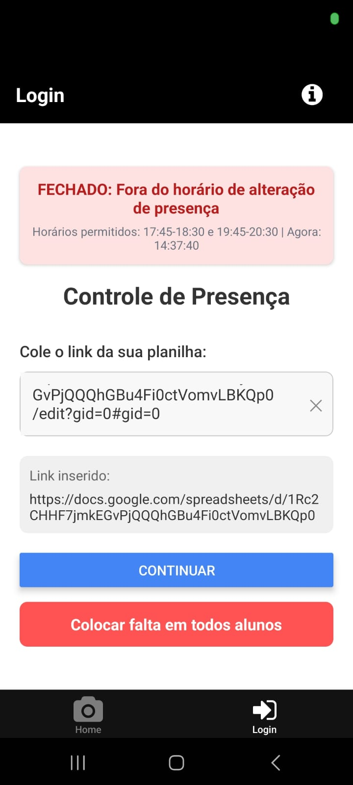
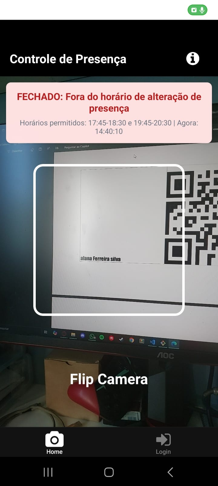
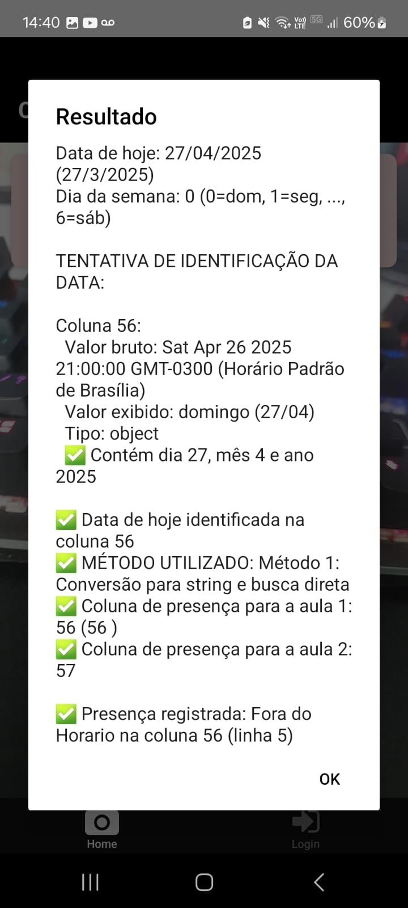
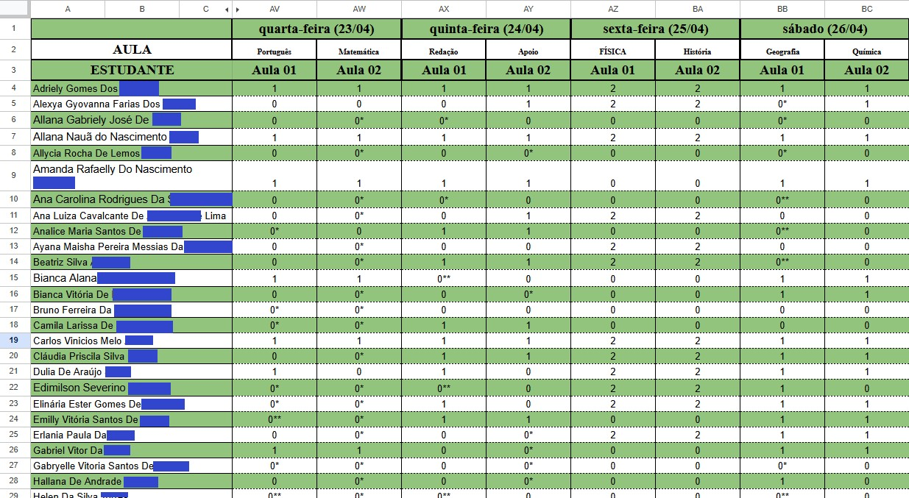

# 📷 QR Code Attendance Scanner

Um app mobile desenvolvido em **React Native** usando **Expo**, que permite **ler QR Codes** para realizar **check-in de presença** em eventos, aulas ou reuniões.

---

## ✨ Funcionalidades

- Leitura de **QR Codes** em tempo real usando a câmera.
- Feedback sonoro ao escanear um código válido (`beep`).
- Integração com **planilhas online** para registrar presença.
- Mudança de câmera (frontal/traseira) com um toque.
- Mira personalizada para facilitar a leitura do QR Code.

---

## 📸 Preview

|           Tela de Scanner            |    Mira Centralizada     |   Log de presença    |
| :----------------------------------: | :----------------------: | :------------------: |
|  |  |  |

|             Resultado             |
| :-------------------------------: |
|  |

---

## 🎯 Motivação

O projeto surgiu de uma necessidade prática no **Portal UFPE**. O processo de controle de presenças era manual, lento e exigia bastante esforço dos voluntários. Inicialmente, adotou-se o uso de QR Codes individuais escaneados por apps genéricos, mas o registro ainda era feito manualmente na planilha do Google Sheets.

Então surgiu a ideia: **e se o QR Code fosse lido e a presença computada automaticamente?**

Com isso, nasceu este aplicativo mobile, desenvolvido em **React Native** com **Expo**, que automatiza todo o processo de registro de presença.

---

## ⚙️ Como funciona

1. O usuário abre o aplicativo e insere o link da planilha do mês (Google Sheets).
2. Um botão permite **preencher faltas automaticamente** para todos os alunos naquele dia.
3. Em seguida, o app leva o usuário para a tela de leitura de QR Code.
4. Cada aluno apresenta seu QR Code, e ao ser lido:
   - A presença é computada diretamente na planilha selecionada.
   - O app respeita o horário atual de Brasília para validar o tipo de presença:
     - **Segunda a quinta-feira:**
       - 17:45 a 18:00 → Presença normal (0 faltas)
       - 18:00 a 18:15 → Presença com atraso leve (0\*)
       - 18:15 a 18:30 → Presença com atraso maior (0\*\*)
       - 18:45 a 19:00 → Presença normal (0 faltas)
       - 19:00 a 19:15 → Presença com atraso leve (0\*)
       - 19:15 a 20:30 → Presença com atraso maior (0\*\*)
       - Ausência → 1 falta
     - **Sexta-feira:**
       - As faltas são **computadas em dobro**.
     - **Sábado:**
       - Os horários são adaptados para atividades pela manhã.
5. O app também fornece feedback visual:

   - Se o horário de registro está aberto, um quadrado **verde** é exibido.
   - Se o horário está fechado, um quadrado **vermelho** aparece.

6. O app ainda emite um som ("beep") ao escanear corretamente cada QR Code.

---

## 🚀 Tecnologias Utilizadas

- [React Native](https://reactnative.dev/)
- [Expo](https://expo.dev/)
- [Expo Camera](https://docs.expo.dev/versions/latest/sdk/camera/)
- [Expo Audio](https://docs.expo.dev/versions/latest/sdk/audio/)
- Integração via API com Google Sheets (para controle de presença)

---

## 🛠️ Como rodar o projeto

1. Clone o repositório:

```bash
git clone https://github.com/seu-usuario/seu-projeto.git
```

2. Instale as dependências:

```bash
npm install
```

3. Inicie o projeto:

```bash
npx expo start
```

4. Escaneie o QR code no seu celular usando o app **Expo Go**.

---

## 📦 Build do APK

Para gerar o `.apk` de instalação:

```bash
npx eas build --platform android --profile preview
```

---

## 💡 Diferenciais do Projeto

- Interface focada em usabilidade rápida e simples.
- Mira customizada para melhorar a experiência do usuário.
- Código limpo, organizado e modular.
- Pensado para ambientes de evento, com fácil expansão para multi-planilhas.

---

## 👨‍💻 Autor

- **Marcelo Victor Batista da Silva**
- [LinkedIn](https://www.linkedin.com/in/mvbs3/)
- [GitHub](https://github.com/mvbs3)

---
